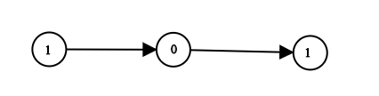

# leetcode - 1290

## 1290. Convert Binary Number in a Linked List to Integer

Given head which is a reference node to a singly-linked list. The value of each node in the linked list is either 0 or 1. The linked list holds the binary representation of a number.

Return the decimal value of the number in the linked list.

Example 1:



```text
Input: head = [1,0,1]
Output: 5
Explanation: (101) in base 2 = (5) in base 10
```

Example 2:

```text
Input: head = [0]
Output: 0
```

Example 3:

```text
Input: head = [1]
Output: 1
```

Example 4:

```text
Input: head = [1,0,0,1,0,0,1,1,1,0,0,0,0,0,0]
Output: 18880
```

Example 5:

```text
Input: head = [0,0]
Output: 0
```

Constraints:

The Linked List is not empty.
Number of nodes will not exceed 30.
Each node's value is either 0 or 1.

### my solution - none

### better solution

```c++
/**
 * Definition for singly-linked list.
 * struct ListNode {
 *     int val;
 *     ListNode *next;
 *     ListNode() : val(0), next(nullptr) {}
 *     ListNode(int x) : val(x), next(nullptr) {}
 *     ListNode(int x, ListNode *next) : val(x), next(next) {}
 * };
 */
class Solution {
public:
    int getDecimalValue(ListNode* head) {
        // 1. 遍历链表
        //ListNode* p =  head;
        vector<int> number;
        while (head != NULL)
        {
            number.push_back(head->val);
            head = head->next;
        }
        
        // 2. convert
        int res = 0;
        int len = number.size();
        int power = 1; // 2^0
        for (int i = len - 1; i >= 0; i--)
        {
            res += (number[i] * power);
            power = power * 2;
        }
        
        return res;
    }
};
```

## Got

1. 链表的遍历
2. 进制转换的新方式 - 定义一个power变量
