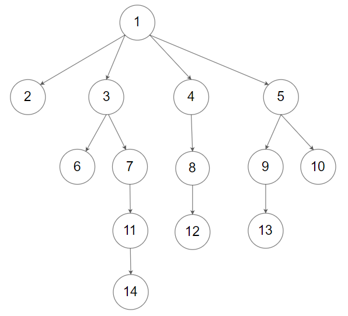

# Leetcode - 589

## 589. N-ary Tree Preorder Traversal

Given an n-ary tree, return the preorder traversal of its nodes' values.

Nary-Tree input serialization is represented in their level order traversal, each group of children is separated by the null value (See examples).

Follow up:

Recursive solution is trivial, could you do it iteratively?


Example 1:

```text
Input: root = [1,null,3,2,4,null,5,6]
Output: [1,3,5,6,2,4]
Example 2:
```



```text
Input: root = [1,null,2,3,4,5,null,null,6,7,null,8,null,9,10,null,null,11,null,12,null,13,null,null,14]
Output: [1,2,3,6,7,11,14,4,8,12,5,9,13,10]
```

Constraints:

```text
The height of the n-ary tree is less than or equal to 1000
The total number of nodes is between [0, 10^4]
```

## my solution - none

## better solution

1. 递归

```c++
/*
// Definition for a Node.
class Node {
public:
    int val;
    vector<Node*> children;

    Node() {}

    Node(int _val) {
        val = _val;
    }

    Node(int _val, vector<Node*> _children) {
        val = _val;
        children = _children;
    }
};
*/

class Solution {
public:
    void travese(Node* root, vector<int>& res)
    {
        if (root == NULL) return;
        res.push_back(root->val);  // 注意值的进入顺序
        for (int i = 0; i < root->children.size(); i++)
        {
            travese(root->children[i], res); // 访问root的第i个孩子
        }
    }
    vector<int> preorder(Node* root) {
        vector<int> res;
        travese(root, res);

        return res;
    }
};
```

2. 迭代

```c++
/*
// Definition for a Node.
class Node {
public:
    int val;
    vector<Node*> children;

    Node() {}

    Node(int _val) {
        val = _val;
    }

    Node(int _val, vector<Node*> _children) {
        val = _val;
        children = _children;
    }
};
*/

class Solution {
public:
    vector<int> preorder(Node* root) {
        if (root == NULL) return {};
        stack<Node*> stk;
        vector<int> res;
        stk.push(root);
        while (!stk.empty()) // stk is not empty
        {
            Node *cur = stk.top();
            stk.pop();
            for (int i = cur->children.size()-1; i >= 0; i--)
                stk.push(cur->children[i]);
            res.push_back(cur->val);
        }

        return res;
    }
};
```

## 一些总结

1. 迭代呀难理解一些，自己演算一下。
2. 有时在一个函数中有些难以处理返回值，试着另写一个帮助函数。
